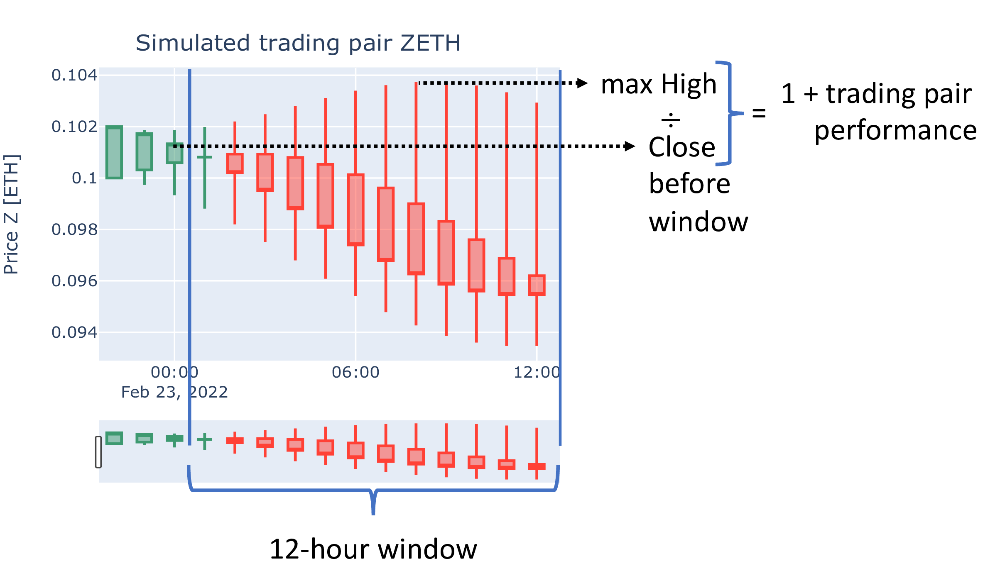

# Introduction

Uncertainty is at the very core of crypto-trading. This statement
certainly is true not only for crypto markets but all types of financial
markets. However, the aspect of uncertainty seems to be more pronounced
in crypto markets, which observe frequent extreme price jumps both in
positive and negative directions.

Uncertainty itself is a very normal phenomenon in everyones’ lives [^1] and 
people would even consider absolute certainty as less
pleasuring [^2]. On the other hand, it is well known that
people develop certan cognitive biases [^3], such that
qualitative and quantitative assessments of uncertainty are not carried
out in a logically coherent fashion [^4].

Therefore, the question arises, how the uncertainty of crypto markets
can be quantified such that a trader gains useful information? Of course
there is the well researched field of volatility, which quantifies
uncertainty as standard deviation of mean return [^5]. 
While volatility models are well understood [^6], it is still a big
leap from these models to a specific trading decision like e.g. the
limit order sell price for a specific crypto trading pair.

A limit order specifies a price at which one is willing to buy or sell a
certain number of tokens at any point in time [^7].
Overall, we can formulate the following requirements for a Crypto Market
Performance with respect to the following dimensions: Chance, Profit,
Feedback, and Dynamics.

Chance  
The Crypto Market Performance measures the chance of a profitable trade.

Profit  
The Crypto Market Performance measures the potential profit of a risk
averse trader.

Feedback  
The Crypto Market Performance is measured retrospectively on a
reasonably short time interval, such that the trader can learn from his
observations.

Dynamics  
The Crypto Market Performance is updated regularly, such that changes in
the market performance can be taken into account for decision making.

Here, we are introducing a measure of Crypto Market
Performance (CMP), mapping the volatility of the market into a
probabilistic statement, which can be easily interpreted with everyone’s
intuition about uncertainty, risk, and chance.

# Crypto market performance

Let’s start with a short recap of candlestick charts. Candlestick charts
combine four different price information over a certain period of time:

-   The *Open* price at the start of the period,

-   the *Close* price at the end of the period,

-   the *High*est price during the period,

-   the *Low*est price during the period.

An example of a simulated candlestick chart is shown in the following figure:

The chart shows the candlesticks for a hypothetical trading
pair over periods of one hour starting on February 22nd at 22:00 UTC.
Candlesticks are either green or red and consist of a box (real body)
and up to two lines extending above and below the real body. These lines
visualize the so-called shadows (candle wicks). The top shadow indicates
the *High* price, the bottom shadow indicates the *Low* price
during the period. The color of the box denotes the interpretation of
the box:

Green  
indicates that the *Close* price is larger than the *Open*
price. In this case, the top of the box indicates the *Close*
price and its bottom indicates the *Open* price.

Red  
indicates that the *Close* price is smaller than the
*Open* price. In this case, the top of the box indicates the
*Open* price and its bottom indicates the *Close* price.

Now, the performance of a trading pair can be computed over a twelve
hour window as ratio of the maximal *High* price to the
*Close* price before the start of the window minus one: 

This
relation is visualized in
Fig. <a href="#fig:candlestick" data-reference-type="ref" data-reference="fig:candlestick">2.1</a>
(p. ) by adding one to the left and right hand side of the previous
equation 
$$\text{trading pair performance} + 1 = \frac{\text{12-hour High}}{\text{Close before window}}.$$
In
Fig. <a href="#fig:candlestick" data-reference-type="ref" data-reference="fig:candlestick">2.1</a>
the *C**l**o**s**e* price before the 12-hour window is 0.09933 ETH and
the maximal High price is observed at 8:00 with 0.1037 ETH. Therefore,
the performance of the ZETH trading pair at is 
$$\frac{0.1037}{0.09933}-1=0.043=4.3\%.$$
Note, that this
performance is known after the 12-hour window has ended at
23rd February 13:00. This means that a trader, who had bought
the hypothetical Z-token for a *C**l**o**s**e* price of 0.09933 ETH just
before the 12-hour window, could have sold it with a profit of 4.3%
although the *C**l**o**s**e* price of the Z-token dropped below its
*O**p**e**n* price at the start of the 12-hour period.

<figure>
<embed src="LFL22pRc_b_token_specific_performance_1200.pdf" id="fig:candlestick" /><figcaption aria-hidden="true">Performance of simulated trading pair ZETH for a 12-hour window. The performance of hypothetical token Z against ETH is computed as the ratio of maximum High price to the Close price before the start of the 12-hour window minus one. The window starts on 23rd February at 1:00 and ends 12 hours later at 13:00. </figcaption>
</figure>

Now, imagine that this performance measure is not only computed for one
trading pair ZETH, but for a selection of trading pairs with ETH base.
For illustration purposes let’s assume that we are considering ten
trading pairs with performances

2.35%, 0.63%, 6.56%, 1.28%, 1.06%, 2.36%, 1.56%, 1.02%, 14.04%, and
0.11%.

The performances of all of these trading pairs can be sorted from
smallest to largest values and the arithmetic mean of two values right
in the middle of the list form the so-called *median* [^8]:
$$  \begin{array}{rrrr}
  0.11\%,& 0.63\%,& 1.02\%,& 1.06\%,
  \end{array}
  \underbrace{
  \begin{array}{rr}
    1.28\%, & 1.56\% 
  \end{array}
}_{\begin{split}\text{median}&=\frac{1.28\%+1.56\%}{2}\\
    &=1.42\%
  \end{split}}
  \begin{array}{rrrr}
  2.35\%, & 2.36\%, & 6.56\%, & 14.04\%  
  \end{array}$$

The median of these trading pairs’ performances has an important
probabilistic interpretation:

> There is a 50% chance, that a randomly picked trading pair performed
> better than the median performance of the respective portfolio.

$$  \underbrace{
    \begin{array}{rrrrr}
  0.11\%,& 0.63\%,& 1.02\%,& 1.06\%,& 1.28\%,    
    \end{array}
  }_{50\%}
  \; \underbrace{1.42\%,}_{\text{median}}\;
  \underbrace{
  \begin{array}{rrrrr}
  1.56\%, & 2.35\%, & 2.36\%, & 6.56\%, & 14.04\%  
  \end{array}}_{50\%}
$$

The median of the trading pair performances is a robust descriptive
statistics of the **crypto market performance** (CMP).

<figure>
<embed src="../notebooks/LFL22qCa_retrospective_CMP__signal.pdf" id="fig:retrospective_CMP" /><figcaption aria-hidden="true">Crypto Market Performance (CMP) from January 2020 to February 2022. The median CMP over this period is 1.85%. During half of the observed 12-hour windows, the CMP is between 1.29% and 2.67% (1st and 3rd quartile). The crypto market boom during the first five months of 2021 (shaded period) is clearly visible.</figcaption>
</figure>

The CMP is descriptive, because it is based on the observed trading pair
performances over the respective 12-hour period. It is robust, because
it is not influenced by extremely well or extremly bad performing
trading pairs. However, the portfolio of trading pairs considered for
computing the crypto market performance does influence the CMP, if more
than 50% of the selected trading pairs are systematically overperforming
or underperforming.

Plotting the CMP over a 26 months period starting with January 2021
(Fig. <a href="#fig:retrospective_CMP" data-reference-type="ref" data-reference="fig:retrospective_CMP">2.2</a>),
shows that the CMP features irregular spikes with CMP’s over 6%. In 75%
of the analysed 12-hour windows, the CMP is below 2.67%, and in 25% of
the analysed 12-hour windows, the CMP is below 1.29%. Therefore, there
is a 50% chance that a randomly selecting 12-hour window had a CMP
between 1.29% and 2.67%. The chart clearly reflects the crypto market
boom during the first five months of 2021 with a clear shift towards
CMPs below 1.29% between end of April and beginning of May 2021.

We conclude that anticipating these changes of the crypto market
dynamics beforehand, clearly would be beneficial to crypto traders.

[^1] Elliott, Andrew C. A. 2021. *What Are the Chances of That?: How to Think
about Uncertainty*. Oxford: Oxford Scholarship Online.
<https://doi.org/10.1093/oso/9780198869023.001.0001>.

[^2] Lee, Yih Hwai, and Cheng Qiu. 2009. “When Uncertainty Brings Pleasure:
The Role of Prospect Imageability and Mental Imagery.” *Journal of
Consumer Research* 36: 624–33. <https://doi.org/10.1086/599766>.

[^3] Kahneman, D. 2011. *Thinking, Fast and Slow*. New York: Farrar, Straus;
Giroux.

[^4] Tversky, Amos, and Derek J. Koehler. 1994. “Support Theory: A
Nonextensional Representation of Subjective Probability.” *Psychological
Review* 101 (4): 547–67.

[^5] Derman, Emauel, and Michael B. Miller. 2016. *The Volatility Smile*.
Hoboken (NJ): Wiley. <https://doi.org/10.1002/9781119289258>.

[^6] Assuming that the number of published books about a topic correlates
with our knowledge and understanding (cf.
<https://www.google.com/search?tbm=bks&q=volatility>).

[^7] Abergel, Frédéric, Marouane Anane, Anirban Chakraborti, Aymen Jedidi,
and Ioane Muni Toke. 2016. *Limit Order Books*. Delhi: Cambridge
University Press.

[^8] For an odd number of trading pairs, the median is the value right in
the middle of the list.
